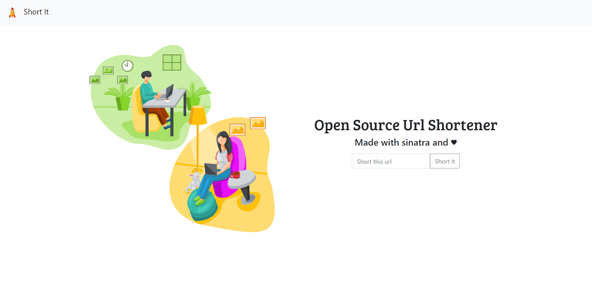

# :rocket: Url Shortener

:exclamation: After clone, execute `bundle` to install the necessary ruby gems

## :information_source: Project Description

An open source url shortener made with the ruby web framework [sinatra](http://sinatrarb.com/).

## :pick: Used Tools

- [Sinatra](http://sinatrarb.com/)
- [Faker](https://github.com/faker-ruby/faker)
- [Postgres](https://www.postgresql.org/) with [pg](https://github.com/ged/ruby-pg) client.
- Active Record
- [Sinatra Active Record](https://github.com/sinatra-activerecord/sinatra-activerecord)
- [Rake](https://github.com/ruby/rake)

## :question: How to use

1. Clone this project.
2. Modify config/database.yml to yours database configuration.
3. Execute `bundle` command.
4. To start application for example in port 3000 execute `rackup -p 3000` command.

## :camera: Screenshots

